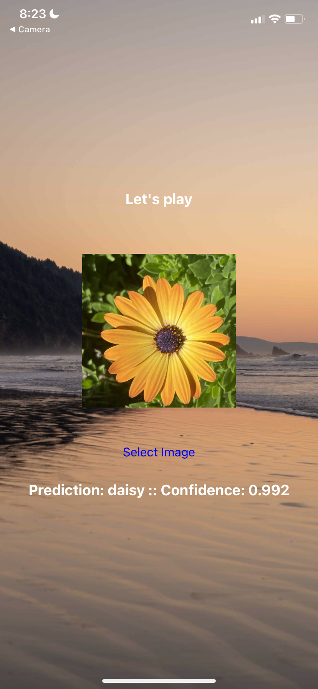

# Object identification sample react-native project

## How to start this project

Run following command first

```
yarn install
```

And then run following to start npx to test

```
npx expo start
```

## Some sample pages are 

Sample image with 99.20% confidence prediction



